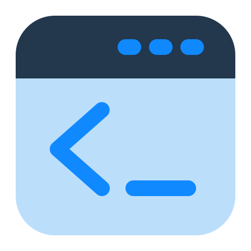

# 🚀 NodeTerm

<div align="center">
  
  <br>
  <b>Cliente SSH moderno y multiplataforma para administradores y devs</b>
  <br><br>
  <a href="https://github.com/kalidus/NodeTerm/releases"></a>
  <a href="LICENSE"></a>
  <a href="https://www.electronjs.org/"></a>
  <a href="#donaciones"></a>
</div>

---

## ✨ ¿Qué es NodeTerm?

NodeTerm es un cliente SSH visual, rápido y personalizable, pensado para administradores, devs y entusiastas que buscan productividad y una experiencia moderna tanto en escritorio como en web/PWA.

- 🔒 **Seguro**: Sincronización y almacenamiento local cifrado.
- ⚡ **Rápido**: Conexión instantánea y gestión de múltiples sesiones.
- 🎨 **Personalizable**: Temas, iconos, fuentes y más.
- 🌐 **Multiplataforma**: Windows, Linux, Mac y versión web progresiva.

<details>
<summary>🖼️ <strong>Ver vista previa</strong></summary>

<div align="center">
  
</div>

</details>

---

## 🚀 Instalación Rápida

### Desktop (Electron)
```sh
# Descarga el instalador desde la sección Releases
https://github.com/kalidus/NodeTerm/releases
```

<details>
<summary>🛠️ <strong>Desarrollo local</strong></summary>

```sh
# Clonar el repositorio
git clone https://github.com/kalidus/NodeTerm.git
cd NodeTerm

# Instalar dependencias
npm install

# Modo desarrollo
npm run dev

# Construir ejecutable
npm run build:win
```

</details>

---

## 🛠️ Características Principales

|  |  |
|--|--|
| 🖥️ Múltiples terminales SSH | 📁 Explorador de archivos remoto |
| 🗂️ Agrupación de pestañas   | 🎨 Temas y personalización total |
| 🔄 Sincronización en tiempo real | 🧩 Soporte para iconos y fuentes |
| 🛡️ Seguridad local y cifrado | 🌙 Modo oscuro y claro |
| 🖱️ Menús contextuales avanzados | ⚡ Atajos de teclado |

<details>
<summary>🔎 <strong>Desglose avanzado de características</strong></summary>

### 🔄 **Sistema de Splits Avanzado**
- Splits horizontales y verticales con redimensionamiento fluido
- Menú contextual intuitivo para elegir orientación
- Barras de separación responsive
- Reutilización de sesiones SSH existentes

### 🌐 **Gestión SSH Profesional**
- Soporte completo para bastiones Wallix
- Autenticación por usuario/contraseña
- Organización jerárquica de sesiones en carpetas
- Agrupación de pestañas por proyectos
- Pool de conexiones para optimización de recursos

### 📊 **Monitoreo y Estadísticas**
- CPU, RAM y carga del sistema en tiempo real
- Gráficas de histórico de rendimiento
- Detección automática de distribuciones Linux
- Indicadores visuales de estado de conexión

### 🎨 **Personalización Total**
- Múltiples temas para terminal y UI
- Fuentes personalizables (FiraCode, JetBrains Mono, etc.)
- Temas de iconos (Material, VSCode, etc.)
- Interfaz responsive y moderna

### 📁 **Explorador de Archivos Integrado**
- Navegación remota por SSH
- Operaciones de archivos (copiar, pegar, eliminar)
- Búsqueda y filtrado inteligente
- Temas de color personalizables

</details>

---

## 🆕 Novedades en v1.5.1

- RDP embebido con Guacamole dentro de pestañas: ya no abre MSTSC aparte
- Backend guacd con autodetección: Docker Desktop → WSL → nativo → mock
- Menu de terminal local limpio: se ocultó RDP del selector de terminales locales
- Detección robusta de distros WSL (incluye Ubuntu 24.04.1 y variantes)
- Mejoras de estabilidad, UI y rendimiento

---

## 🎨 Personalización

- Cambia temas, iconos y fuentes desde el menú de configuración.
- Sincroniza tus preferencias entre escritorio y web.
- Soporte para temas personalizados y extensiones (próximamente).

---

---

## 🏗️ Arquitectura Técnica

<details>
<summary>🛠️ <strong>Stack y estructura</strong></summary>

**Stack Tecnológico**
```
Frontend:  React 18 + PrimeReact + React Icons
Backend:   Electron 28 + Node.js
SSH:       node-ssh + ssh2-promise  
Terminal:  xterm.js + addons
Build:     Webpack 5 + Babel
```

**Estructura del Proyecto**
```
NodeTerm/
├── 📁 src/
│   ├── 📁 components/     # Componentes React
│   ├── 📁 assets/         # Estilos CSS
│   └── 📄 themes.js       # Temas del terminal
├── 📄 main.js             # Proceso principal Electron
├── 📄 preload.js          # Script de preload
└── 📄 webpack.config.js   # Configuración Webpack
```

</details>

---

## 🗓️ Roadmap

| Versión | Características | Estado |
|---------|----------------|--------|
| **v1.5.1** | 🖥️ RDP embebido con Guacamole + mejoras WSL | ✅ Actual |
| **v1.6.0** | 🔑 Soporte para llaves SSH | 📋 Planificado |
| **v1.7.0** | 🖥️ Terminal integrado con múltiples shells | 💭 Concepto |

---

## 📝 Changelog

### v1.5.1
- Integración de RDP embebido con Guacamole (pestañas dedicadas)
- Inicio de guacd con prioridad: Docker Desktop → WSL → nativo → mock
- Limpieza del selector de terminales locales (sin RDP)
- Detección mejorada de WSL: soporte para Ubuntu-YY.MM(.x) como 24.04.1
- Varios fixes y optimizaciones de UI/rendimiento

### v1.4.1
- Soporte completo para conexiones RDP con smart sizing
- Corrección de errores en conexiones RDP desde sidebar
- Mejoras de estabilidad y rendimiento
- UI refinada y más moderna
- Sincronización mejorada entre escritorio y web
- Corrección de bugs y optimizaciones

### v1.4.0
- Exportación/importación de configuraciones
- Mejoras de estabilidad y rendimiento
- UI refinada y más moderna
- Sincronización mejorada entre escritorio y web
- Corrección de bugs y optimizaciones

### v1.3.0
- Menús contextuales para explorador de sesiones
- Menú contextual en área vacía del árbol
- Interface más limpia sin botones inline

<details>
<summary>Ver más versiones...</summary>

### v1.2.0
- Sistema de versionado implementado
- Diálogo "Acerca de" con información completa
- Versión mostrada en barra de estado
- Interfaz mejorada con diseño profesional

### v1.1.0
- Panel lateral optimizado
- Iconos automáticos por distribución Linux
- Sistema de overflow inteligente
- Funcionalidad move-to-front
- Corrección de memory leaks

</details>

---

## 💰 Donaciones

¿Te gusta NodeTerm? Puedes apoyar el desarrollo con una donación en cripto:

- **ETH y tokens EVM:** `0xE6df364718CCFB96025eF24078b7C8D387a47242`
- **Solana (SOL):** `3b4UFMaXHmuincSXKpfgCoroFV1RYZVaAWbGTcfeNh5q`

¡Gracias por tu apoyo! 🙏

---

## 🤝 Contribuciones

¡Las contribuciones son bienvenidas! Si quieres ayudar a mejorar NodeTerm:

1. 🍴 **Fork** el repositorio
2. 🌿 Crea una **rama** para tu feature (`git checkout -b feature/nueva-funcionalidad`)
3. 💾 **Commit** tus cambios (`git commit -m 'feat: añadir nueva funcionalidad'`)
4. 📤 **Push** a la rama (`git push origin feature/nueva-funcionalidad`)
5. 🔄 Abre un **Pull Request**

### 🐛 Reportar Bugs
- Usa las [GitHub Issues](https://github.com/kalidus/NodeTerm/issues)
- Incluye detalles del sistema operativo y versión de NodeTerm
- Proporciona pasos para reproducir el problema

### 💡 Solicitar Funcionalidades
- Abre una [Feature Request](https://github.com/kalidus/NodeTerm/issues/new)
- Describe claramente la funcionalidad deseada
- Explica cómo mejoraría la experiencia de usuario

---

## 🤖 Sobre el Desarrollo

**NodeTerm** es un proyecto innovador desarrollado utilizando **IA avanzada** en colaboración humano-máquina. Lo que comenzó como un ejercicio de **vibe coding** se ha transformado en una herramienta profesional y moderna, específicamente diseñada para **administradores de infraestructuras** que necesitan una solución SSH robusta y eficiente.

¡Las PRs y sugerencias son bienvenidas! Consulta [CONTRIBUTING.md](CONTRIBUTING.md) para más detalles.

---

## 📄 Licencia

MIT. Hecho con ❤️ por [kalidus](https://github.com/kalidus).

---

## ☕ ¿Te gusta el proyecto?

Puedes invitarme a un café ☕ o dejar una estrella ⭐ en GitHub. ¡Gracias! 
