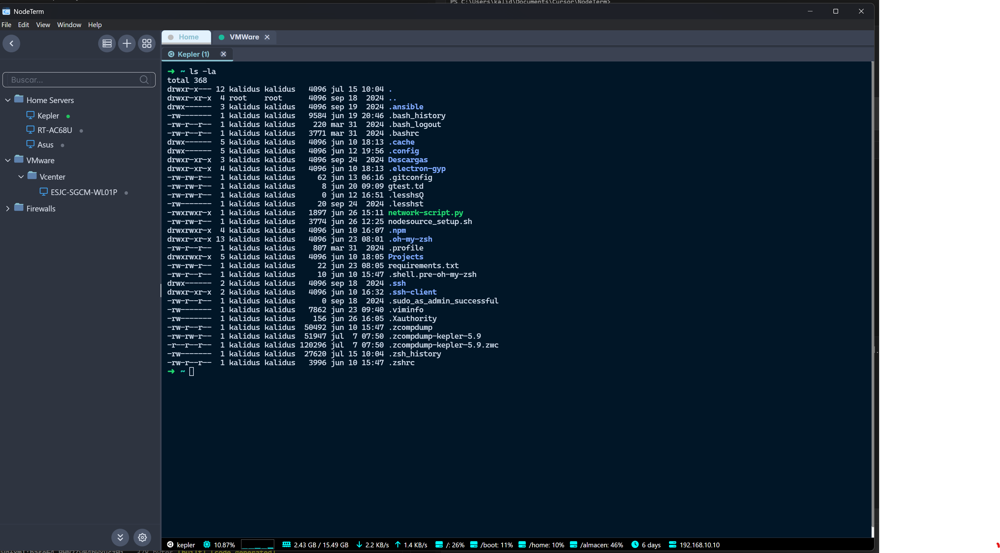

# 🚀 NodeTerm - Terminal SSH Avanzado para Electron

<div align="center">
  
[](https://github.com/kalidus/NodeTerm/releases)
[](LICENSE)
[](https://electronjs.org/)
[](#-donaciones)

**Una aplicación de terminal SSH moderna y potente construida con Electron y React**

✨ Gestión avanzada de sesiones SSH | 🔀 Sistema de splits horizontal/vertical | 📊 Monitoreo en tiempo real | 🎨 Múltiples temas
  
</div>

---

<div align="center">
  
  <b>Vista previa de NodeTerm</b><br><br>
  
  
</div>

---

## ✨ Características Principales

### 🔄 **Sistema de Splits Avanzado** *(Nuevo en v1.3.1)*
- 🔀 Splits **horizontales y verticales** con redimensionamiento fluido
- 🎯 Menú contextual intuitivo para elegir orientación
- 📐 Barras de separación responsive con constraints dinámicos
- 🔄 Reutilización de sesiones SSH existentes

### 🌐 **Gestión SSH Profesional**
- 🏢 Soporte completo para **bastiones Wallix**
- 🔑 Autenticación por usuario/contraseña
- 🌳 Organización jerárquica de sesiones en carpetas
- 👥 Agrupación de pestañas por proyectos
- 🔄 Pool de conexiones para optimización de recursos

### 📊 **Monitoreo y Estadísticas**
- 💻 **CPU, RAM y carga del sistema** en tiempo real
- 📈 Gráficas de histórico de rendimiento
- 🐧 Detección automática de distribuciones Linux
- 📍 Indicadores visuales de estado de conexión

### 🎨 **Personalización Total**
- 🌙 **Múltiples temas** para terminal y UI
- 🔤 Fuentes personalizables (FiraCode, JetBrains Mono, etc.)
- 🎯 Temas de iconos (Material, VSCode, etc.)
- 📱 Interfaz responsive y moderna

### 📁 **Explorador de Archivos Integrado**
- 🗂️ Navegación remota por SSH
- 📋 Operaciones de archivos (copiar, pegar, eliminar)
- 🔍 Búsqueda y filtrado inteligente
- 🎨 Temas de color personalizables

## 🚀 Instalación y Uso Rápido

### 📦 Descargar Ejecutable
```bash
# Descargar la última versión desde GitHub Releases
# Archivo: NodeTerm-1.3.1-Setup.exe (Windows)
```

### 🛠️ Desarrollo Local
```bash
# Clonar el repositorio
git clone https://github.com/kalidus/NodeTerm.git
cd NodeTerm

# Instalar dependencias
npm install

# Modo desarrollo
npm run dev

# Construir ejecutable
npm run build:win
```

## 🆕 Novedades en v1.3.1

### 🔀 **Sistema de Splits Completamente Rediseñado**
- ✅ **Split horizontal y vertical** con interfaz intuitiva
- ✅ **Menú contextual mejorado** - clic derecho → "Abrir en Split" → elegir orientación
- ✅ **Redimensionamiento robusto** - constraints dinámicos que evitan que el resizer desaparezca
- ✅ **Implementación nativa** con `react-resizable` - sin dependencias problemáticas
- ✅ **Persistencia de sesiones** - las conexiones SSH se mantienen al cambiar pestañas

### 🎨 **Mejoras de UI/UX**
- ✅ **Labels mejorados** - Split │ (vertical) y Split ─ (horizontal)
- ✅ **Barras de separación visibles** con hover effects
- ✅ **Menús contextuales organizados** por pestaña SSH disponible

### 🔧 **Optimizaciones Técnicas**
- ✅ **Eliminación de logs innecesarios** - consola más limpia
- ✅ **Migración de dependencias** - react-split-pane → react-resizable
- ✅ **Webpack simplificado** - mejor compatibilidad con Electron

## ⚙️ Personalización de Temas
- **Terminal**: Material Dark, Solarized, One Dark, Custom
- **UI**: Light, Dark, Auto (según sistema)
- **Iconos**: Material, VSCode, Feather
- **Fuentes**: FiraCode Nerd Font, JetBrains Mono, Cascadia Code

---

## 💰 Donaciones

<div align="center">

### 🚀 **¿Te gusta NodeTerm? ¡Apoya el desarrollo!**

Tu apoyo ayuda a mantener y mejorar NodeTerm, añadiendo nuevas funcionalidades y corrigiendo bugs.

#### 🪙 **Donaciones en Criptomonedas**

**📡 Redes EVM (Ethereum, Polygon, BSC, etc.):**
<div align="center">

```
0xE6df364718CCFB96025eF24078b7C8D387a47242
```

</div>

**⚡ Red Solana:**
<div align="center">

```
3b4UFMaXHmuincSXKpfgCoroFV1RYZVaAWbGTcfeNh5q
```

</div>

**Criptomonedas Aceptadas:**
- 💎 **Ethereum (ETH)** - Red principal
- ⚡ **Solana (SOL)** - Red Solana
- 💵 **USDC** - Ethereum/Polygon/Solana
- 🔶 **Binance Coin (BNB)** - BSC
- 🟣 **Polygon (MATIC)** - Red Polygon
- ✨ **Y cualquier otra crypto compatible**

<sub>⚠️ **Importante:** Verifica siempre la compatibilidad de red antes de enviar.</sub>

**🙏 ¡Cada donación, por pequeña que sea, es muy apreciada!**

</div>

---

## 🤝 Contribuciones

¡Las contribuciones son bienvenidas! Si quieres ayudar a mejorar NodeTerm:

1. 🍴 **Fork** el repositorio
2. 🌿 Crea una **rama** para tu feature (`git checkout -b feature/nueva-funcionalidad`)
3. 💾 **Commit** tus cambios (`git commit -m 'feat: añadir nueva funcionalidad'`)
4. 📤 **Push** a la rama (`git push origin feature/nueva-funcionalidad`)
5. 🔄 Abre un **Pull Request**

### 🐛 Reportar Bugs
- Usa las [GitHub Issues](https://github.com/kalidus/NodeTerm/issues)
- Incluye detalles del sistema operativo y versión de NodeTerm
- Proporciona pasos para reproducir el problema

### 💡 Solicitar Funcionalidades
- Abre una [Feature Request](https://github.com/kalidus/NodeTerm/issues/new)
- Describe claramente la funcionalidad deseada
- Explica cómo mejoraría la experiencia de usuario

---

## 🤖 Sobre el Desarrollo

**NodeTerm** es un proyecto innovador desarrollado utilizando **IA avanzada** en colaboración humano-máquina. Lo que comenzó como un ejercicio de **vibe coding** se ha transformado en una herramienta profesional y moderna, específicamente diseñada para **administradores de infraestructuras** que necesitan una solución SSH robusta y eficiente.

Este proyecto demuestra el potencial de la programación asistida por IA para crear aplicaciones complejas y funcionales que resuelven problemas reales en entornos empresariales.

---

## 📄 Licencia

Este proyecto está bajo la **Licencia MIT** - ver el archivo [LICENSE](LICENSE) para más detalles.

---

<div align="center">

### 🌟 **¡Dale una estrella al proyecto si te gusta!**

**Desarrollado con ❤️ por [kalidus](https://github.com/kalidus)**

[](https://github.com/kalidus/NodeTerm/stargazers)
[](https://github.com/kalidus/NodeTerm/network)

</div> 