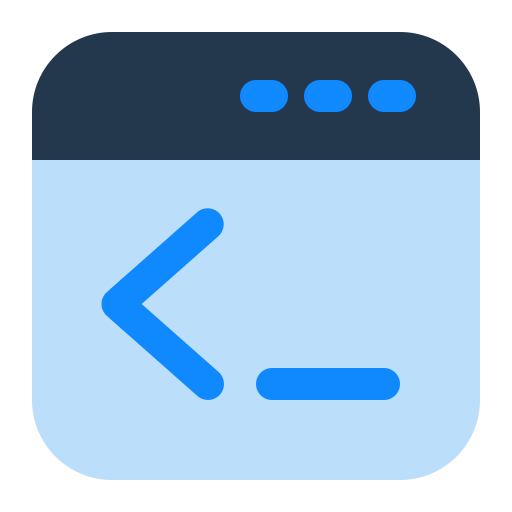

# 🚀 NodeTerm

<div align="center">
  
  <br>
  <b>Cliente SSH moderno y multiplataforma para administradores y devs</b>
  <br><br>
  <a href="https://github.com/kalidus/NodeTerm/releases"></a>
  <a href="LICENSE"></a>
  <a href="https://www.electronjs.org/"></a>
  <a href="#donaciones"></a>
</div>

---

## ✨ ¿Qué es NodeTerm?

NodeTerm es un cliente SSH visual, rápido y personalizable, pensado para administradores, devs y entusiastas que buscan productividad y una experiencia moderna tanto en escritorio como en web/PWA.

- 🔒 **Seguro**: Encriptación AES-256 para credenciales y datos sensibles.
- ⚡ **Rápido**: Conexión instantánea y gestión de múltiples sesiones.
- 🎨 **Personalizable**: Temas, iconos, fuentes y más.
- 🌐 **Multiplataforma**: Windows, Linux, Mac y versión web progresiva.

<details>
<summary>🖼️ <strong>Ver vista previa</strong></summary>

<div align="center">
  
</div>

</details>

---

## 🚀 Instalación Rápida

### Desktop (Electron)
```sh
# Descarga el instalador desde la sección Releases
https://github.com/kalidus/NodeTerm/releases
```

<details>
<summary>🛠️ <strong>Desarrollo local</strong></summary>

```sh
# Clonar el repositorio
git clone https://github.com/kalidus/NodeTerm.git
cd NodeTerm

# Node.js 24 LTS recomendado (nvm: nvm install && nvm use)
# Linux (Arch/CachyOS): sudo pacman -S --needed base-devel python

# Instalar dependencias (sin sudo)
npm install

# Modo desarrollo
npm run dev

# Construir ejecutable
npm run build:win
```

En Linux, `npm install` ejecuta automáticamente la reparación del binario de Electron si la instalación quedó incompleta. No uses `sudo npm install` dentro del proyecto.

</details>

---

## 🛠️ Características Principales

|  |  |
|--|--|
| 🖥️ Múltiples terminales SSH | 📁 Explorador de archivos remoto |
| 🗂️ Agrupación de pestañas   | 🎨 Temas y personalización total |
| 🔄 Sincronización en tiempo real | 🧩 Soporte para iconos y fuentes |
| 🛡️ Seguridad local y cifrado | 🌙 Modo oscuro y claro |
| 🖱️ Menús contextuales avanzados | ⚡ Atajos de teclado |
| 🔄 Actualizaciones automáticas | 🔌 Servidor MCP Integrado (API Key) |

<details>
<summary>🔎 <strong>Desglose avanzado de características</strong></summary>

### 🔄 **Sistema de Splits Avanzado**
- Splits horizontales y verticales con redimensionamiento fluido
- Menú contextual intuitivo para elegir orientación
- Barras de separación responsive
- Reutilización de sesiones SSH existentes

### 🔌 **Servidor MCP Integrado (Model Context Protocol)**
- **Servidor Integrado Seguro**: Servidor nativo con comunicación segura mediante autenticación por API Key.
- **Acceso a Datos**: Permite a agentes de IA externos consultar de forma segura conexiones, contraseñas y notas/documentos.
- **Gestión de Recursos**: Soporte para la creación, consulta y edición remota de credenciales y notas de forma controlada.

### 🌐 **Gestión SSH Profesional**
- Soporte completo para bastiones Wallix
- Autenticación por usuario/contraseña
- Organización jerárquica de sesiones en carpetas
- Agrupación de pestañas por proyectos
- Pool de conexiones para optimización de recursos

### 🔌 **Túneles SSH Avanzados**
- **Túneles Locales (-L)**: Redirige puerto local a servidor remoto
- **Túneles Remotos (-R)**: Redirige puerto remoto a servidor local
- **Proxy SOCKS Dinámico (-D)**: Proxy SOCKS5 para enrutar todo el tráfico
- **Verificación de Puertos**: Verificación automática de puertos libres antes de crear túneles
- **Limpieza Automática**: Cierre automático de túneles anteriores que usen el mismo puerto
- **Gestión de Recursos**: Prevención de puertos ocupados y túneles huérfanos
- **Limpieza al Cerrar**: Todos los túneles se cierran correctamente al cerrar la aplicación
- **Logs en Tiempo Real**: Visualización de logs y estado de túneles activos

### 🚀 **Optimizaciones de Arranque**
- **Arranque Mucho Más Rápido**: Optimizaciones significativas que reducen drásticamente el tiempo de inicio
- **Lazy Loading Inteligente**: Módulos pesados se cargan solo cuando se necesitan
- **Inicialización Diferida**: Servicios pesados se inicializan después de mostrar la ventana
- **Registro Progresivo**: Handlers críticos primero, secundarios después para no bloquear la UI
- **Profiler Integrado**: Sistema de medición de tiempos para monitorear el arranque

### 📊 **Monitoreo y Estadísticas**
- CPU, RAM y carga del sistema en tiempo real
- Gráficas de histórico de rendimiento
- Detección automática de distribuciones Linux
- Indicadores visuales de estado de conexión

### 🎨 **Personalización Total**
- Múltiples temas para terminal y UI
- Fuentes personalizables (FiraCode, JetBrains Mono, etc.)
- Temas de iconos (Material, VSCode, etc.)
- Interfaz responsive y moderna

### 📁 **Explorador de Archivos Integrado**
- Navegación remota por SSH
- Operaciones de archivos (copiar, pegar, eliminar)
- Búsqueda y filtrado inteligente
- Temas de color personalizables

### 🔄 **Sistema de Actualización Automática**
- Actualizaciones desde GitHub Releases
- Comprobación automática configurable (cada 1-168 horas)
- Descarga en segundo plano sin interrumpir tu trabajo
- Notificaciones de nuevas versiones disponibles
- Instalación con un clic
- Soporte para canales stable/beta
- Actualizaciones firmadas y verificadas

</details>

---

## 📦 Versión y cambios

El historial detallado vive solo en **[CHANGELOG.md](CHANGELOG.md)**. Las [GitHub Releases](https://github.com/kalidus/NodeTerm/releases) y el asistente `npm run release` usan esa fuente para publicar las notas.

| | |
|--|--|
| **Última publicada** | **[v1.7.0](https://github.com/kalidus/NodeTerm/releases/tag/v1.7.0)** (17 julio 2026) |
| **Instaladores** | [Descargas en Releases](https://github.com/kalidus/NodeTerm/releases) |

**Resumen de v1.7.0:** (Preparando versión 1.7.0 - Llaves SSH y autenticación mejorada).

**Resumen de v1.6.9:** incorpora un servidor nativo de Model Context Protocol (MCP) altamente seguro con soporte para exponer y gestionar de forma externa las conexiones, contraseñas y notas de NodeTerm mediante autenticación por API Key.

**Resumen de v1.6.8:** retira el chat de IA integrado y el MCP nativo de NodeTerm; mantiene clientes IA dedicados (AnythingLLM, CLI, Docker); menos carga en arranque y sync más limpio entre instancias.

---

## 🎨 Personalización

- Cambia temas, iconos y fuentes desde el menú de configuración.
- Sincroniza tus preferencias entre escritorio y web.
- Soporte para temas personalizados y extensiones (próximamente).

---

## 🔄 Sistema de Actualización

NodeTerm incluye un sistema de actualización automática que mantiene tu aplicación siempre al día:

### Configuración

Accede a `Configuración → Actualizaciones` para personalizar:

- **Actualizaciones Automáticas**: Activa/desactiva la comprobación automática
- **Intervalo de Comprobación**: Configura cada cuántas horas buscar actualizaciones (1-168 horas)
- **Descarga Automática**: Las actualizaciones se descargan en segundo plano automáticamente
- **Canal de Actualizaciones**: 
  - **Estable (Recomendado)**: Versiones probadas y estables
  - **Beta**: Versiones de prueba con nuevas funcionalidades

### Procedimiento de Actualización

1. **Comprobación**: La app comprueba automáticamente si hay nuevas versiones en GitHub Releases
2. **Notificación**: Si hay una actualización disponible, recibirás una notificación
3. **Descarga**: La actualización se descarga en segundo plano sin interrumpir tu trabajo
4. **Instalación**: Cuando esté lista, haz clic en "Instalar y Reiniciar" para aplicar la actualización
5. **Reinicio**: La aplicación se reinicia automáticamente con la nueva versión

### Actualización Manual

Si prefieres controlar las actualizaciones manualmente:

1. Abre `Configuración → Actualizaciones`
2. Haz clic en **"Buscar Actualizaciones"**
3. Si hay una versión disponible, haz clic en **"Descargar"**
4. Una vez descargada, haz clic en **"Instalar y Reiniciar"**

### Seguridad

- Todas las actualizaciones provienen de GitHub Releases oficial
- Las actualizaciones están firmadas y verificadas automáticamente
- El proceso de actualización es completamente seguro y no requiere permisos de administrador

---

## 🏗️ Arquitectura Técnica

<details>
<summary>🛠️ <strong>Stack y estructura</strong></summary>

**Stack Tecnológico**
```
Frontend:  React 18 + PrimeReact + React Icons
Backend:   Electron 28 + Node.js
SSH:       node-ssh + ssh2-promise  
Terminal:  xterm.js + addons
Build:     Webpack 5 + Babel
```

**Estructura del Proyecto**
```
NodeTerm/
├── 📁 src/
│   ├── 📁 components/     # Componentes React
│   ├── 📁 assets/         # Estilos CSS
│   └── 📄 themes.js       # Temas del terminal
├── 📄 main.js             # Proceso principal Electron
├── 📄 preload.js          # Script de preload
└── 📄 webpack.config.js   # Configuración Webpack
```

</details>

---

## 🗓️ Roadmap

| Versión | Foco | Estado |
|---------|------|--------|
| **v1.7.0** | Llaves SSH y autenticación mejorada | 📋 Preparando release |
| **v1.6.9** | Actualización de captura y versión | ✅ Publicada |
| **v1.8.0** | Terminal multi-shell integrado | 💭 Concepto |

Versiones anteriores: [CHANGELOG.md](CHANGELOG.md).

---

## 💰 Donaciones

¿Te gusta NodeTerm? Puedes apoyar el desarrollo con una donación en cripto:

- **ETH y tokens EVM:** `0xE6df364718CCFB96025eF24078b7C8D387a47242`
- **Solana (SOL):** `3b4UFMaXHmuincSXKpfgCoroFV1RYZVaAWbGTcfeNh5q`

¡Gracias por tu apoyo! 🙏

---

## 🤝 Contribuciones

¡Las contribuciones son bienvenidas! Si quieres ayudar a mejorar NodeTerm:

1. 🍴 **Fork** el repositorio
2. 🌿 Crea una **rama** para tu feature (`git checkout -b feature/nueva-funcionalidad`)
3. 💾 **Commit** tus cambios (`git commit -m 'feat: añadir nueva funcionalidad'`)
4. 📤 **Push** a la rama (`git push origin feature/nueva-funcionalidad`)
5. 🔄 Abre un **Pull Request**

### 🐛 Reportar Bugs
- Usa las [GitHub Issues](https://github.com/kalidus/NodeTerm/issues)
- Incluye detalles del sistema operativo y versión de NodeTerm
- Proporciona pasos para reproducir el problema

### 💡 Solicitar Funcionalidades
- Abre una [Feature Request](https://github.com/kalidus/NodeTerm/issues/new)
- Describe claramente la funcionalidad deseada
- Explica cómo mejoraría la experiencia de usuario

---

## 🔒 Seguridad y Encriptación

NodeTerm incluye un sistema completo de encriptación AES-256 para proteger todas las credenciales y datos sensibles:

- **Encriptación AES-256**: Grado militar para passwords y conexiones
- **Master Password**: Clave única para desbloquear la aplicación
- **Auto-Unlock**: Opción para no pedir contraseña cada vez
- **Migración Automática**: Encripta datos existentes sin pérdida
- **Retrocompatibilidad**: Funciona con y sin encriptación

📖 **Documentación completa**: [docs/SISTEMA_ENCRIPTACION.md](docs/SISTEMA_ENCRIPTACION.md)

---

## 📹 Sistema de Auditoría y Grabación

NodeTerm incluye un sistema completo de grabación y auditoría de sesiones SSH para compliance, debugging y documentación:

- **Grabación en tiempo real**: Captura toda la entrada/salida de sesiones SSH
- **Formato estándar**: Compatible con asciicast v2 (asciinema)
- **Reproductor integrado**: Playback con controles de velocidad
- **Búsqueda y filtrado**: Encuentra grabaciones por conexión
- **Exportación**: Comparte grabaciones en formato estándar
- **Almacenamiento local**: Sin dependencias de servicios externos

📖 **Guía completa**: [docs/GUIA_AUDITORIA_SESIONES.md](docs/GUIA_AUDITORIA_SESIONES.md)

---

## 🤖 Sobre el Desarrollo

**NodeTerm** es un proyecto innovador desarrollado utilizando **IA avanzada** en colaboración humano-máquina. Lo que comenzó como un ejercicio de **vibe coding** se ha transformado en una herramienta profesional y moderna, específicamente diseñada para **administradores de infraestructuras** que necesitan una solución SSH robusta y eficiente.

¡Las PRs y sugerencias son bienvenidas! Consulta [CONTRIBUTING.md](CONTRIBUTING.md) para más detalles.

---

## 📄 Licencia

MIT. Hecho con ❤️ por [kalidus](https://github.com/kalidus).

---

## ☕ ¿Te gusta el proyecto?

Puedes invitarme a un café ☕ o dejar una estrella ⭐ en GitHub. ¡Gracias! 
