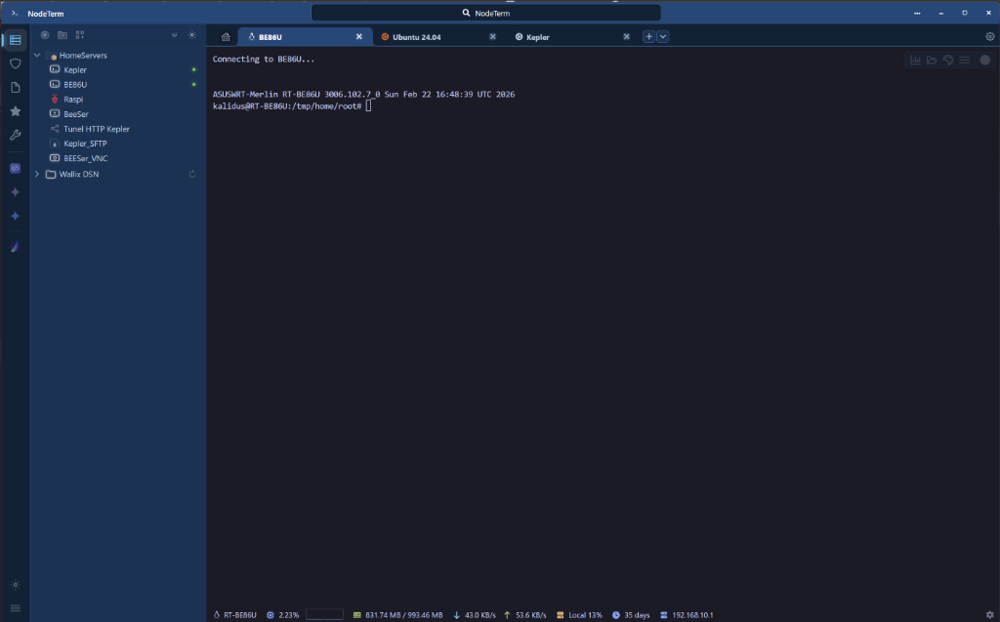

#                                   🚀 NodeTerm 
#                           Cliente SSH para Administradores

<div align="center">
  
[](https://github.com/kalidus/NodeTerm/releases)
[](LICENSE)
[](https://electronjs.org/)
[](#-donaciones)

**Una aplicación de terminal SSH moderna y potente, construida con Electron y React**

✨ Gestión avanzada de sesiones SSH | 🔀 Sistema de splits horizontal/vertical | 📊 Monitoreo en tiempo real | 🎨 Múltiples temas
  
</div>

---

<div align="center">
  
  <b>Vista previa de NodeTerm</b><br><br>
  
  
</div>

---

## ✨ Características Principales

### 🔄 **Sistema de Splits Avanzado** *(Nuevo en v1.4.0)*
- 🔀 Splits **horizontales y verticales** con redimensionamiento fluido
- 🎯 Menú contextual intuitivo para elegir orientación
- 📐 Barras de separación responsive con constraints dinámicos
- 🔄 Reutilización de sesiones SSH existentes

### 🌐 **Gestión SSH Profesional**
- 🏢 Soporte completo para **bastiones Wallix**
- 🔑 Autenticación por usuario/contraseña
- 🌳 Organización jerárquica de sesiones en carpetas
- 👥 Agrupación de pestañas por proyectos
- 🔄 Pool de conexiones para optimización de recursos

### 📊 **Monitoreo y Estadísticas**
- 💻 **CPU, RAM y carga del sistema** en tiempo real
- 📈 Gráficas de histórico de rendimiento
- 🐧 Detección automática de distribuciones Linux
- 📍 Indicadores visuales de estado de conexión

### 🎨 **Personalización Total**
- 🌙 **Múltiples temas** para terminal y UI
- 🔤 Fuentes personalizables (FiraCode, JetBrains Mono, etc.)
- 🎯 Temas de iconos (Material, VSCode, etc.)
- 📱 Interfaz responsive y moderna

### 📁 **Explorador de Archivos Integrado**
- 🗂️ Navegación remota por SSH
- 📋 Operaciones de archivos (copiar, pegar, eliminar)
- 🔍 Búsqueda y filtrado inteligente
- 🎨 Temas de color personalizables

## 🚀 Instalación y Uso Rápido

### 📦 Descargar Ejecutable
```bash
# Descargar la última versión desde GitHub Releases
# Archivo: NodeTerm-1.4.0-Setup.exe (Windows)
[Descargar última release (v1.4.0)](https://github.com/kalidus/NodeTerm/releases/tag/v1.4.0)
```

### 🛠️ Desarrollo Local
```bash
# Clonar el repositorio
git clone https://github.com/kalidus/NodeTerm.git
cd NodeTerm

# Instalar dependencias
npm install

# Modo desarrollo
npm run dev

# Construir ejecutable
npm run build:win
```

## 🆕 Novedades en v1.4.0

### 🔀 **Sistema de Splits Completamente Rediseñado**
- ✅ **Split horizontal y vertical** con interfaz intuitiva
- ✅ **Menú contextual mejorado** - clic derecho → "Abrir en Split" → elegir orientación
- ✅ **Redimensionamiento robusto** - constraints dinámicos que evitan que el resizer desaparezca
- ✅ **Implementación nativa** con `react-resizable` - sin dependencias problemáticas
- ✅ **Persistencia de sesiones** - las conexiones SSH se mantienen al cambiar pestañas

### 🎨 **Mejoras de UI/UX**
- ✅ **Labels mejorados** - Split │ (vertical) y Split ─ (horizontal)
- ✅ **Barras de separación visibles** con hover effects
- ✅ **Menús contextuales organizados** por pestaña SSH disponible

### 🔧 **Optimizaciones Técnicas**
- ✅ **Eliminación de logs innecesarios** - consola más limpia
- ✅ **Migración de dependencias** - react-split-pane → react-resizable
- ✅ **Webpack simplificado** - mejor compatibilidad con Electron

## ⚙️ Personalización de Temas
- **Terminal**: Material Dark, Solarized, One Dark, Custom
- **UI**: Light, Dark, Auto (según sistema)
- **Iconos**: Material, VSCode, Feather
- **Fuentes**: FiraCode Nerd Font, JetBrains Mono, Cascadia Code

---

## 🎨 **Interfaz de Usuario**

<details>
<summary>📋 <strong>Diálogo "Acerca de"</strong></summary>

- ℹ️ Información completa de la aplicación
- 🔧 Versiones técnicas (Electron, Node.js, Chromium)
- 📋 Lista de características principales
- 📅 Fecha de compilación
</details>

<details>
<summary>📊 <strong>Barra de Estado</strong></summary>

- 📈 **Métricas del servidor**: CPU, RAM, Disco, Red
- 🐧 **Iconos automáticos** por distribución
- 📍 **Información de red**: IP, hostname
- ⏱️ **Uptime** del sistema
- 🏷️ **Versión** de la aplicación
</details>

<details>
<summary>🎯 <strong>Sistema de Pestañas</strong></summary>

- 🏷️ **Iconos automáticos** según distribución
- 📑 **Overflow inteligente** para muchas pestañas
- 🔝 **Move-to-front** para acceso rápido
- 🔄 **Drag & drop** para reorganización
- ❌ **Cierre individual** de pestañas
</details>

---

## ⚙️ **Configuración**

### 🖥️ **Terminal**
```
Fuentes: FiraCode, Cascadia Code, JetBrains Mono, etc.
Tamaños: 8px - 24px configurables
Temas: Múltiples temas predefinidos
```

### 🔐 **SSH**
```
✅ Almacenamiento seguro de credenciales
📁 Organización en carpetas jerárquicas
🎯 Configuración de directorios remotos por defecto
```

---

## 🏗️ **Arquitectura Técnica**

### **Stack Tecnológico**
```
Frontend:  React 18 + PrimeReact + React Icons
Backend:   Electron 28 + Node.js
SSH:       node-ssh + ssh2-promise  
Terminal:  xterm.js + addons
Build:     Webpack 5 + Babel
```

### **Estructura del Proyecto**
```
NodeTerm/
├── 📁 src/
│   ├── 📁 components/     # Componentes React
│   ├── 📁 assets/         # Estilos CSS
│   └── 📄 themes.js       # Temas del terminal
├── 📄 main.js             # Proceso principal Electron
├── 📄 preload.js          # Script de preload
└── 📄 webpack.config.js   # Configuración Webpack
```

---

## 🐛 **Solución de Problemas**

<details>
<summary><strong>🧠 Memory Leaks</strong></summary>

- ✅ Sistema de limpieza automática de event listeners
- 📊 Tracking de listeners activos por pestaña
- 🗑️ Remoción automática al cerrar pestañas
</details>

<details>
<summary><strong>⚡ Rendimiento</strong></summary>

- 🔄 Lazy loading de componentes
- 📑 Gestión eficiente de pestañas
- 🎯 Optimización de re-renders
</details>

<details>
<summary><strong>🔗 Conexiones SSH</strong></summary>

- 🔄 Pool de conexiones reutilizables
- ⏱️ Timeout configurables
- 🛡️ Manejo robusto de errores de red
</details>

---

## 🗓️ **Roadmap**

| Versión | Características | Estado |
|---------|----------------|--------|
| **v1.3.0** | 🎨 Configuración de temas personalizados | 🔄 Desarrollo |
| **v1.4.0** | 📤 Exportación/importación de configuraciones | 📋 Planificado |
| **v1.5.0** | 🔑 Soporte para llaves SSH | 📋 Planificado |
| **v1.6.0** | 🖥️ Terminal integrado con múltiples shells | 💭 Concepto |

---

## 📝 **Changelog**

### **v1.4.0** *(Actual)*
- 📤 Exportación/importación de configuraciones
- 🖥️ Mejoras en la interfaz y experiencia de usuario
- 🐛 Corrección de bugs y optimizaciones

<details>
<summary><strong>Ver versiones anteriores...</strong></summary>

### **v1.3.0**
- ✨ Menús contextuales para explorador de sesiones
- 🆕 Menú contextual en área vacía del árbol
- 🐛 Corrección de confirmaciones duplicadas
- 🧹 Interface más limpia sin botones inline

### **v1.1.0**
- 🎉 Sistema de versionado implementado
- 📋 Diálogo "Acerca de" con información completa
- 📍 Versión mostrada en barra de estado
- 🎨 Interfaz mejorada con diseño profesional

### **v1.0.0**
- 📏 Panel lateral optimizado
- 🐧 Iconos automáticos por distribución Linux
- 🔄 Sistema de overflow inteligente
- 📋 Funcionalidad move-to-front
- 🐛 Corrección de memory leaks

</details>

---

## 🤝 **Contribuir**

<table>
<tr>
<td width="50%">

### 🚀 **Pasos Rápidos**
1. 🍴 Fork el proyecto
2. 🌿 Crea tu rama (`git checkout -b feature/AmazingFeature`)
3. 💾 Commit tus cambios (`git commit -m 'Add: AmazingFeature'`)
4. 📤 Push a la rama (`git push origin feature/AmazingFeature`)
5. 🔀 Abre un Pull Request

</td>
<td width="50%">

### 📋 **Convenciones**
- **feat:** Nueva característica
- **fix:** Corrección de bug
- **docs:** Documentación
- **style:** Formato de código
- **refactor:** Refactorización
- **test:** Pruebas

</td>
</tr>
</table>

---

## 📄 **Licencia**

Este proyecto está bajo la **Licencia ISC** - ver [LICENSE](LICENSE) para detalles.

---

## 🙏 **Reconocimientos**
=======
## 💰 Donaciones
>>>>>>> v1.3.1

<div align="center">

### 🚀 **¿Te gusta NodeTerm? ¡Apoya el desarrollo!**

Tu apoyo ayuda a mantener y mejorar NodeTerm, añadiendo nuevas funcionalidades y corrigiendo bugs.

#### 🪙 **Donaciones en Criptomonedas**

**📡 Redes EVM (Ethereum, Polygon, BSC, etc.):**
<div align="center">

```
0xE6df364718CCFB96025eF24078b7C8D387a47242
```

</div>

**⚡ Red Solana:**
<div align="center">

```
3b4UFMaXHmuincSXKpfgCoroFV1RYZVaAWbGTcfeNh5q
```

</div>

**Criptomonedas Aceptadas:**
- 💎 **Ethereum (ETH)** - Red principal
- ⚡ **Solana (SOL)** - Red Solana
- 💵 **USDC** - Ethereum/Polygon/Solana
- 🔶 **Binance Coin (BNB)** - BSC
- 🟣 **Polygon (MATIC)** - Red Polygon
- ✨ **Y cualquier otra crypto compatible**

<sub>⚠️ **Importante:** Verifica siempre la compatibilidad de red antes de enviar.</sub>

**🙏 ¡Cada donación, por pequeña que sea, es muy apreciada!**

</div>

---

## 🤝 Contribuciones

¡Las contribuciones son bienvenidas! Si quieres ayudar a mejorar NodeTerm:

1. 🍴 **Fork** el repositorio
2. 🌿 Crea una **rama** para tu feature (`git checkout -b feature/nueva-funcionalidad`)
3. 💾 **Commit** tus cambios (`git commit -m 'feat: añadir nueva funcionalidad'`)
4. 📤 **Push** a la rama (`git push origin feature/nueva-funcionalidad`)
5. 🔄 Abre un **Pull Request**

### 🐛 Reportar Bugs
- Usa las [GitHub Issues](https://github.com/kalidus/NodeTerm/issues)
- Incluye detalles del sistema operativo y versión de NodeTerm
- Proporciona pasos para reproducir el problema

### 💡 Solicitar Funcionalidades
- Abre una [Feature Request](https://github.com/kalidus/NodeTerm/issues/new)
- Describe claramente la funcionalidad deseada
- Explica cómo mejoraría la experiencia de usuario

---

## 🤖 Sobre el Desarrollo

**NodeTerm** es un proyecto innovador desarrollado utilizando **IA avanzada** en colaboración humano-máquina. Lo que comenzó como un ejercicio de **vibe coding** se ha transformado en una herramienta profesional y moderna, específicamente diseñada para **administradores de infraestructuras** que necesitan una solución SSH robusta y eficiente.

Este proyecto demuestra el potencial de la programación asistida por IA para crear aplicaciones complejas y funcionales que resuelven problemas reales en entornos empresariales.

---

## 📄 Licencia

Este proyecto está bajo la **Licencia MIT** - ver el archivo [LICENSE](LICENSE) para más detalles.

---

<div align="center">

### 🌟 **¡Dale una estrella al proyecto si te gusta!**

**Desarrollado con ❤️ por [kalidus](https://github.com/kalidus)**

[](https://github.com/kalidus/NodeTerm/stargazers)
[](https://github.com/kalidus/NodeTerm/network)

</div> 
