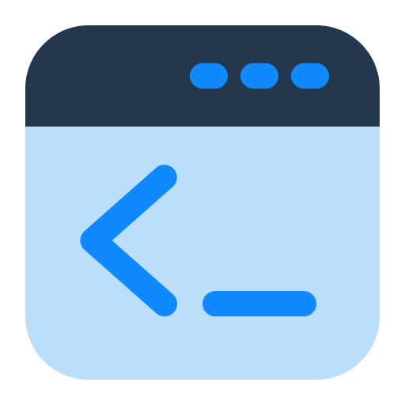
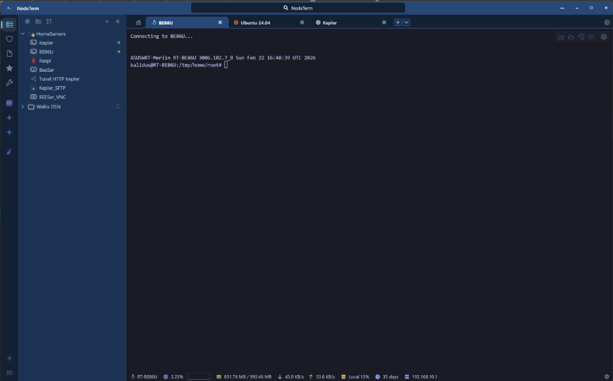

<div align="center">

  

  # 🚀 NodeTerm

  <b>Un cliente de acceso remoto "all-in-one" moderno, multiprotocolo, con bóveda de contraseñas e IA integrada en un espacio multipestaña ultrarrápido.</b>

  <p align="center">
    <a href="README.md"></a>
    <a href="README.en.md"></a>
  </p>

  <p align="center">
    <a href="https://github.com/kalidus/NodeTerm/releases"></a>
    <a href="https://github.com/kalidus/NodeTerm/releases"></a>
    <a href="#-servidor-mcp-integrado-model-context-protocol"></a>
    <a href="https://github.com/kalidus/NodeTerm/releases"></a>
    <a href="https://github.com/kalidus/NodeTerm/stargazers"></a>
    <a href="LICENSE"></a>
    <a href="#donar"></a>
  </p>

  <p align="center">
    <a href="https://github.com/kalidus/NodeTerm/releases/latest">
      
    </a>
    &nbsp;
    <a href="#-instalación-rápida">
      
    </a>
  </p>

  

</div>

---

## ✨ Características Destacadas

NodeTerm es un espacio de trabajo remoto *all-in-one* que unifica múltiples protocolos de conexión, una bóveda cifrada de credenciales y capacidades avanzadas de automatización con IA en una interfaz moderna y ultrarrápida.

### 🌐 1. Conexión & Soporte Multiprotocolo
- 🖥️ **Multiprotocolo Completo**: Soporte nativo para conexiones **SSH**, **RDP** (Escritorio Remoto), **VNC** y **SFTP**.
- 🛡️ **Gestión SSH Profesional**: Conexión a bastiones Wallix, autenticación por clave/contraseña y pool de conexiones optimizado.
- 🗂️ **Espacio de Trabajo Multipestaña**: Organización jerárquica de sesiones en carpetas y agrupación de pestañas por proyectos.
- 📁 **Explorador SFTP Integrado**: Navegación remota visual, operaciones de archivos (copiar, pegar, eliminar) y búsqueda inteligente.

### 🤖 2. Ecosistema de IA Avanzado (Servidor MCP Integrado)
- 🔌 **Servidor MCP Nativo**: Protocolo estándar (Model Context Protocol) para conectar agentes de IA externos (Claude, Cursor, Antigravity, AnythingLLM).
- 🛡️ **Seguridad & Prompt Ticket**: Inyección segura de secretos y credenciales (`promptTicket`) sin exponer contraseñas al agente de IA.
- 📑 **Acceso a Recursos**: Los agentes de IA pueden consultar y gestionar de forma autorizada conexiones, notas, documentos y terminales abiertos.

### 🔒 3. Seguridad & Bóveda de Credenciales (Vault)
- 🛡️ **Encriptación AES-256**: NodeTerm incluye un sistema completo de encriptación AES-256 para proteger todas las credenciales y datos sensibles almacenados localmente.
- 🔑 **Master Password & Auto-Lock**: Clave única para desbloquear la aplicación con temporizador de bloqueo automático.
- 📹 **Sistema de Auditoría y Grabación**: Incluye un sistema completo de grabación y auditoría de sesiones SSH para compliance, debugging y documentación:

### ⚡ 4. Productividad, Splits & Red Remota
- 🖥️ **Splits a 60 FPS**: Motor `xterm.js` con división de pantalla horizontal y vertical, redimensionamiento fluido y menús contextuales.
- 🔌 **Túneles SSH Avanzados**: Túneles Locales (`-L`), Remotos (`-R`) y Proxy SOCKS5 Dinámico (`-D`) con verificación automática de puertos libres y limpieza de puertos huérfanos.
- 📹 **Auditoría & Grabación asciinema**: Captura toda la entrada/salida de sesiones SSH en formato estándar `asciicast v2` (.cast) con reproductor integrado.
- 🚀 **Arranque Ultra-Rápido**: Carga diferida inteligente (*Lazy Loading*) de módulos y servicios pesados.

### 📊 5. Monitoreo del Sistema & Diagnóstico
- 📈 **Telemetría en Tiempo Real**: Métricas de CPU, memoria RAM y carga del sistema en tiempo real con gráficas de histórico.
- 🐧 **Auto-detección OS**: Detección automática de distribuciones Linux e indicadores visuales de estado de conexión.

### 🎨 6. Personalización Total & UX
- 🎨 **Temas de UI y Terminal**: Selección de múltiples temas oscuros y claros con personalización de paletas de color.
- 🔤 **Fuentes & Iconos**: Soporte para fuentes especializadas con ligaduras (*FiraCode*, *JetBrains Mono*) y packs de iconos (*Material*, *VSCode*).
- ⌨️ **Atajos & Layout**: Configuración completa de teclado, pestañas organizables por proyectos y menús contextuales avanzados.
- 🔄 **Actualizador Automático**: Comprobación en segundo plano desde GitHub Releases con canales Estable y Beta.

---

## 🚀 Instalación Rápida

### Desktop (Electron)
```sh
# Descarga el instalador ejecutable (.exe / .AppImage / .deb / pacman)
https://github.com/kalidus/NodeTerm/releases
```

<details>
<summary>🛠️ <strong>Desarrollo local</strong></summary>

```sh
# Clonar el repositorio
git clone https://github.com/kalidus/NodeTerm.git
cd NodeTerm

# Node.js 24 LTS recomendado (nvm: nvm install && nvm use)
# Linux (Arch/CachyOS): sudo pacman -S --needed base-devel python

# Instalar dependencias (sin sudo)
npm install

# Modo desarrollo
npm run dev

# Construir ejecutable
npm run build:win
```

En Linux, `npm install` ejecuta automáticamente la reparación del binario de Electron si la instalación quedó incompleta. No uses `sudo npm install` dentro del proyecto.

</details>

---

## 📦 Versión y cambios

El historial detallado vive solo en **[CHANGELOG.md](CHANGELOG.md)**. Las [GitHub Releases](https://github.com/kalidus/NodeTerm/releases) y el asistente `npm run release` usan esa fuente para publicar las notas.

| | |
|--|--|
| **Ultima publicada** | **[v1.7.4](https://github.com/kalidus/NodeTerm/releases/tag/v1.7.4)** (31 julio 2026) |
| **Instaladores** | [Descargas en Releases](https://github.com/kalidus/NodeTerm/releases) |

**Resumen de v1.7.4:** hotfix clipboard en build de produccion (handler IPC aislado + fallback; dependencia `tar` para Joplin).

**Resumen de v1.7.3:** rendimiento (xterm 60 FPS, splitter, telemetria adaptativa), UX unificada (`AppDialog`/`AppConfirm`), Cygwin bajo demanda, conexiones desde sidebar/tabs, formularios estandarizados, i18n y clipboard aislado del lock MCP.

**Resumen de v1.7.2:** proceso de release y publicacion en GitHub Actions (notas detalladas en la linea 1.7.3).

**Resumen de v1.7.1:** MCP con control de terminales abiertos, buffer de salida e inyeccion segura de secretos (`promptTicket`); sin exponer contrasenas al agente.

**Resumen de v1.7.0:** monitor SSH de servicios/logs, estabilidad GPU/Linux (NVIDIA/Wayland), updater Linux seguro e instalador `pacman` para Arch/CachyOS.

**Resumen de v1.6.9:** incorpora un servidor nativo de Model Context Protocol (MCP) altamente seguro con soporte para exponer y gestionar de forma externa las conexiones, contraseñas y notas de NodeTerm mediante autenticación por API Key.

**Resumen de v1.6.8:** retira el chat de IA integrado y el MCP nativo de NodeTerm; mantiene clientes IA dedicados (AnythingLLM, CLI, Docker); menos carga en arranque y sync más limpio entre instancias.

---

## 🎨 Personalización

- Cambia temas, iconos y fuentes desde el menú de configuración.
- Sincroniza tus preferencias entre escritorio y web.
- Soporte para temas personalizados y extensiones (próximamente).

---

## 🏗️ Arquitectura Técnica

<details>
<summary>🛠️ <strong>Stack y estructura</strong></summary>

**Stack Tecnológico**
```
Frontend:  React 18 + PrimeReact + React Icons
Backend:   Electron 28 + Node.js
SSH:       node-ssh + ssh2-promise  
Terminal:  xterm.js + addons
Build:     Webpack 5 + Babel
```

**Estructura del Proyecto**
```
NodeTerm/
├── 📁 src/
│   ├── 📁 components/     # Componentes React
│   ├── 📁 assets/         # Estilos CSS
│   └── 📄 themes.js       # Temas del terminal
├── 📄 main.js             # Proceso principal Electron
├── 📄 preload.js          # Script de preload
└── 📄 webpack.config.js   # Configuración Webpack
```

</details>

---

## 🗓️ Roadmap

| Version | Foco | Estado |
|---------|------|--------|
| **v1.7.4** | Hotfix clipboard en release | Publicada |
| **v1.7.3** | Rendimiento, UX unificada, Cygwin on-demand | Publicada |
| **v1.7.2** | Proceso release / CI | Publicada |
| **v1.7.1** | MCP agent: terminales abiertos e inject seguro | Incluida en linea 1.7.x |
| **v1.7.0** | Monitor SSH, GPU/Linux y pacman | Incluida en linea 1.7.x |
| **v1.6.9** | Servidor MCP nativo | Publicada |
| **v1.8.0** | Terminal multi-shell integrado | Concepto |

Versiones anteriores: [CHANGELOG.md](CHANGELOG.md).

---

<a id="donar"></a>
## 💖 Apoyar el Proyecto

Si **NodeTerm** te resulta útil para tu trabajo diario y quieres apoyar su mantenimiento y desarrollo continuo, puedes patrocinar el proyecto en GitHub o dejar una estrella ⭐ en el repositorio.

Tu apoyo me permite dedicar tiempo continuo al desarrollo, mejorar la seguridad de la bóveda, añadir nuevos protocolos y ampliar la integración con IA y agentes MCP.

<p align="left">
  <a href="https://github.com/sponsors/kalidus"></a>
  &nbsp;
  <a href="SPONSORS.md"></a>
</p>

### 🏆 Niveles de Patrocinio Destacados
- ☕ **Developer Coffee ($5/mes)**: Mención en `SPONSORS.md` e insignia oficial de Sponsor en GitHub.
- 🚀 **Ecosystem Supporter ($25/mes)**: Mención destacada en `README.md` y `SPONSORS.md` + voto prioritario en roadmap.
- 🏢 **Infrastructure Partner ($100/mes)**: Logo corporativo y enlace en `README.md` y `SPONSORS.md` + agradecimiento especial en Release Notes.
- 👑 **Lead Visionary Partner ($250+/mes)**: Banner preferencial en la portada de `README.md` y `SPONSORS.md` + canal prioritario de desarrollo de integraciones MCP.

Consulta todos los detalles, metas y recompensas en el archivo [**SPONSORS.md**](SPONSORS.md).

<details>
<summary><b>Otras formas de contribución puntual (Crypto / Donaciones directas)</b></summary>

<br/>
<p align="left">
  <a href="https://ko-fi.com/kalidus"></a>
  &nbsp;
  <a href="https://buymeacoffee.com/kalidus"></a>
</p>

<p align="left">
  <a href="https://etherscan.io/address/0x7D18e60b2717edA94e6a48d05e6d09038dCf9342"></a>
  &nbsp;
  <a href="https://solscan.io/account/DAP3efj9Fvp1uvf8eVse3dMTxxyw2bWLh4snA891iNZh"></a>
</p>
</details>

¡Cualquier apoyo, por pequeño que sea, ayuda enormemente a impulsar la evolución de NodeTerm! 🙏

---

## 🤝 Contribuciones

¡Las contribuciones son bienvenidas! Si quieres ayudar a mejorar NodeTerm:

1. 🍴 **Fork** el repositorio
2. 🌿 Crea una **rama** para tu feature (`git checkout -b feature/nueva-funcionalidad`)
3. 💾 **Commit** tus cambios (`git commit -m 'feat: añadir nueva funcionalidad'`)
4. 📤 **Push** a la rama (`git push origin feature/nueva-funcionalidad`)
5. 🔄 Abre un **Pull Request**

### 🐛 Reportar Bugs
- Usa las [GitHub Issues](https://github.com/kalidus/NodeTerm/issues)
- Incluye detalles del sistema operativo y versión de NodeTerm
- Proporciona pasos para reproducir el problema

### 💡 Solicitar Funcionalidades
- Abre una [Feature Request](https://github.com/kalidus/NodeTerm/issues/new)
- Describe claramente la funcionalidad deseada
- Explica cómo mejoraría la experiencia de usuario

---

## 🤖 Sobre el Desarrollo

**NodeTerm** es un proyecto innovador desarrollado utilizando **IA avanzada** en colaboración humano-máquina. Lo que comenzó como un ejercicio de **vibe coding** se ha transformado en una herramienta profesional y moderna, específicamente diseñada para **administradores de infraestructuras** que necesitan una solución SSH robusta y eficiente.

¡Las PRs y sugerencias son bienvenidas! Consulta [CONTRIBUTING.md](CONTRIBUTING.md) para más detalles.

---

## 📄 Licencia

MIT. Hecho con ❤️ por [kalidus](https://github.com/kalidus).
