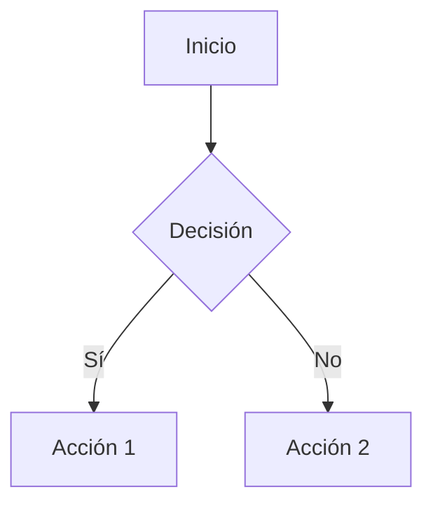

# Pendientes para Mejorar el Formato de Texto

## 📋 Resumen de Estado Actual

### ✅ Lo que YA funciona:
- Markdown básico (negrita, cursiva, listas, etc.)
- Bloques de código con syntax highlighting (highlight.js)
- Títulos (H1-H6) con emojis automáticos
- Tablas básicas
- Enlaces básicos
- Blockquotes básicos
- Procesamiento de títulos malformados
- Iconos para [FILE] y [DIR]

---

## 🔴 Pendientes CRÍTICOS (Alta Prioridad)

### 1. **Subscript y Superscript**
**Estado**: No implementado  
**Prioridad**: Alta  
**Uso común**: Fórmulas químicas, matemáticas, notas

**Ejemplos que deberían funcionar:**
```
H~2~O (agua)
E=mc^2^ (energía)
CO~2~ (dióxido de carbono)
```

**Implementación necesaria:**
- Agregar soporte en marked.js para `~texto~` (subscript) y `^texto^` (superscript)
- O usar HTML: `<sub>texto</sub>` y `<sup>texto</sup>`
- Estilos CSS para sub/sup

---

### 2. **Footnotes (Notas al pie)**
**Estado**: No implementado  
**Prioridad**: Alta  
**Uso común**: Referencias, citas, explicaciones adicionales

**Ejemplo que debería funcionar:**
```
Este es un texto con una nota[^1].

[^1]: Esta es la nota al pie de página.
```

**Implementación necesaria:**
- Extensión de marked.js para footnotes
- Renderizado de notas al final del mensaje
- Enlaces clickeables entre referencia y nota

---

### 3. **Definition Lists (Listas de definición)**
**Estado**: No implementado  
**Prioridad**: Media  
**Uso común**: Glosarios, términos técnicos

**Ejemplo que debería funcionar:**
```
Término 1
: Definición del término 1

Término 2
: Definición del término 2
```

**Implementación necesaria:**
- Soporte en marked.js (GFM no lo incluye por defecto)
- Estilos CSS para `<dl>`, `<dt>`, `<dd>`

---

### 4. **Mejorar Renderizado de Enlaces**
**Estado**: Básico  
**Prioridad**: Alta  
**Problema actual**: Los enlaces solo se muestran como texto azul

**Mejoras necesarias:**
- [ ] Preview de enlaces (hover muestra preview)
- [ ] Icono de enlace externo (🔗)
- [ ] Indicador visual de enlaces internos vs externos
- [ ] Botón para abrir en nueva pestaña más visible
- [ ] Validación de URLs antes de renderizar

**Ejemplo mejorado:**
```
[Texto del enlace](https://ejemplo.com) 🔗
```

---

## 🟡 Pendientes IMPORTANTES (Media Prioridad)

### 5. **Números de Línea en Bloques de Código**
**Estado**: No implementado  
**Prioridad**: Media  
**Uso común**: Referencias a líneas específicas, debugging

**Mejoras necesarias:**
- [ ] Agregar números de línea opcionales
- [ ] Toggle para mostrar/ocultar números
- [ ] Resaltar líneas específicas (por rango o número)
- [ ] Copiar con números de línea o sin ellos

**Ejemplo:**
```
1  | function ejemplo() {
2  |   return "hola";
3  | }
```

---

### 6. **Mejorar Visualización de Bloques de Código**
**Estado**: Básico  
**Prioridad**: Media  

**Mejoras necesarias:**
- [ ] Mejor diferenciación visual por lenguaje
- [ ] Icono del lenguaje más visible
- [ ] Botón "Copiar" más accesible
- [ ] Botón "Ejecutar código" para lenguajes soportados (JavaScript, Python, etc.)
- [ ] Mejor contraste y legibilidad
- [ ] Scroll horizontal mejorado para código largo

---

### 7. **Soporte para Emojis Mejorado**
**Estado**: Parcial  
**Prioridad**: Media  
**Problema actual**: Los emojis funcionan pero no hay autocompletado

**Mejoras necesarias:**
- [ ] Autocompletado de emojis al escribir `:emoji:`
- [ ] Selector visual de emojis
- [ ] Mejor renderizado de emojis (tamaño consistente)
- [ ] Soporte para emojis personalizados

**Ejemplo:**
```
Escribe :smile: y se convierte en 😊
```

---

### 8. **Menciones (@usuario) y Hashtags (#tag)**
**Estado**: No implementado  
**Prioridad**: Baja  
**Uso común**: Referencias, etiquetado, organización

**Ejemplo que debería funcionar:**
```
Hola @usuario, revisa esto #importante
```

**Implementación necesaria:**
- [ ] Detectar `@usuario` y renderizar como mención
- [ ] Detectar `#tag` y renderizar como hashtag
- [ ] Estilos CSS para menciones y hashtags
- [ ] Click en hashtag para buscar/filtrar

---

## 🟢 Pendientes OPCIONALES (Baja Prioridad)

### 9. **Soporte para Diagramas (Mermaid, PlantUML)**
**Estado**: No implementado  
**Prioridad**: Baja  
**Uso común**: Diagramas de flujo, arquitectura, secuencia

**Ejemplo Mermaid:**
````

````

**Implementación necesaria:**
- [ ] Instalar `mermaid` o `@mermaid-js/mermaid`
- [ ] Detectar bloques de código con lenguaje `mermaid`
- [ ] Renderizar diagramas en lugar de código
- [ ] Estilos CSS para diagramas

---

### 10. **Mejorar Tablas**
**Estado**: Básico  
**Prioridad**: Baja  

**Mejoras necesarias:**
- [ ] Mejor alineación de columnas
- [ ] Resaltado de filas al hover
- [ ] Tablas responsivas (scroll horizontal en móvil)
- [ ] Soporte para tablas con encabezados fijos
- [ ] Mejor contraste y legibilidad

---

### 11. **Mejorar Blockquotes**
**Estado**: Básico  
**Prioridad**: Baja  

**Mejoras necesarias:**
- [ ] Mejor estilo visual (borde más visible)
- [ ] Soporte para blockquotes anidados
- [ ] Icono de cita más visible
- [ ] Mejor contraste de fondo

---

## 🛠️ Implementación Sugerida (Orden de Prioridad)

### Fase 1: Formato Básico Mejorado (Esta semana)
1. ✅ Subscript y superscript
2. ✅ Footnotes
3. ✅ Definition lists
4. ✅ Mejorar enlaces (preview, iconos)

### Fase 2: Código Mejorado (Próxima semana)
1. ✅ Números de línea en bloques de código
2. ✅ Mejorar visualización de bloques de código
3. ✅ Botón "Ejecutar código" para lenguajes soportados

### Fase 3: Extensiones Sociales (Siguiente semana)
1. ✅ Emojis mejorados (autocompletado)
2. ✅ Menciones (@usuario)
3. ✅ Hashtags (#tag)

### Fase 4: Diagramas y Avanzado (Futuro)
1. ✅ Soporte para Mermaid
2. ✅ Mejorar tablas y blockquotes

---

## 📝 Notas Técnicas

### Dependencias Necesarias

```json
{
  "marked": "^16.4.1",  // Ya instalado
  "marked-footnotes": "^1.0.0",  // Para footnotes
  "mermaid": "^10.6.1",  // Para diagramas (opcional)
  "emoji-mart": "^5.5.2"  // Para selector de emojis (opcional)
}
```

### Archivos a Modificar

1. **`src/components/AIChatPanel.js`**
   - Función `renderMarkdown()` - Agregar procesamiento de sub/sup, footnotes, etc.
   - Agregar renderizado de diagramas Mermaid

2. **`src/styles/components/ai-chat.css`**
   - Estilos para sub/sup
   - Estilos para footnotes
   - Estilos para definition lists
   - Estilos mejorados para enlaces
   - Estilos para números de línea en código

3. **`src/services/MarkdownFormatter.js`** (si existe)
   - Mejorar procesamiento de markdown
   - Agregar extensiones personalizadas

---

## 🎯 Checklist de Implementación

### Formato Básico
- [ ] Subscript (`~texto~`)
- [ ] Superscript (`^texto^`)
- [ ] Footnotes (`[^1]` y `[^1]: nota`)
- [ ] Definition lists (`Término : Definición`)

### Enlaces
- [ ] Preview de enlaces al hover
- [ ] Icono de enlace externo
- [ ] Indicador visual interno vs externo
- [ ] Validación de URLs

### Código
- [ ] Números de línea opcionales
- [ ] Resaltado de líneas específicas
- [ ] Botón "Ejecutar código"
- [ ] Mejor diferenciación por lenguaje
- [ ] Copiar con/sin números de línea

### Extensiones
- [ ] Autocompletado de emojis (`:emoji:`)
- [ ] Selector visual de emojis
- [ ] Menciones (`@usuario`)
- [ ] Hashtags (`#tag`)

### Diagramas
- [ ] Soporte para Mermaid
- [ ] Renderizado de diagramas inline

---

## 💡 Ejemplos de Uso Esperados

### Con Subscript/Superscript:
```
H~2~SO~4~ (ácido sulfúrico)
E=mc^2^ (fórmula de Einstein)
```

### Con Footnotes:
```
Este texto tiene una nota[^1] y otra[^2].

[^1]: Primera nota al pie
[^2]: Segunda nota al pie
```

### Con Definition Lists:
```
Markdown
: Lenguaje de marcado ligero

LaTeX
: Sistema de composición tipográfica
```

### Con Enlaces Mejorados:
```
[Documentación](https://docs.ejemplo.com) 🔗
```

### Con Números de Línea:
```
1  | function ejemplo() {
2  |   const x = 10;
3  |   return x * 2;
4  | }
```

---

**Total de mejoras pendientes**: ~15 funcionalidades  
**Prioridad Alta**: 4 funcionalidades  
**Prioridad Media**: 4 funcionalidades  
**Prioridad Baja**: 7 funcionalidades

