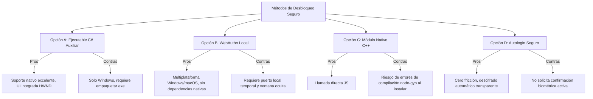

# Plan de Implementación: Integración de Windows Hello y Métodos de Desbloqueo Seguro en NodeTerm

Este documento evalúa las opciones técnicas para añadir la funcionalidad de desbloqueo mediante sistemas biométricos (Windows Hello, huella dactilar, PIN) o métodos alternativos que mejoren la experiencia del usuario sin comprometer la seguridad.

---

## Opciones de Implementación Analizadas

A continuación se presentan las 4 opciones técnicas identificadas para integrar sistemas de seguridad más cómodos y modernos.

### Opción A: Ejecutable C# Auxiliar Precompilado (`WindowsHelloHelper.exe`) [RECOMENDADA]

Consiste en compilar una aplicación de consola en C# muy ligera (menos de 100 KB) que acceda directamente a las APIs de Windows Runtime (`UserConsentVerifierInterop`). Electron ejecuta este `.exe` de forma transparente enviándole el identificador de ventana (`HWND`) obtenido mediante `mainWindow.getNativeWindowHandle()`.

*   **Cómo funciona**:
    1. Electron invoca el ejecutable y le pasa el identificador de la ventana principal.
    2. El ejecutable levanta el prompt del sistema de Windows Hello (huella, cara o PIN) directamente centrado sobre NodeTerm.
    3. El ejecutable retorna un código de salida (`0` para verificado, `1` para cancelado, etc.).
*   **Pros**:
    *   **Excelente integración de UI**: Al pasar el `HWND`, la ventana de Windows Hello aparece acoplada a NodeTerm, impidiendo que quede en segundo plano.
    *   **Sin problemas de instalación**: Al ser un binario precompilado empaquetado en `resources/binaries/`, no requiere compilar código C++ durante `npm install` (evita requerir Visual Studio Build Tools).
*   **Cons**:
    *   **Platform-specific**: Código exclusivo para Windows (si se migra a macOS en el futuro, se requeriría una alternativa para Touch ID).

---

### Opción B: WebAuthn (FIDO2) a través de Servidor Local Seguro (`http://127.0.0.1`)

Consiste en usar la API estándar de Chromium/WebAuthn (`navigator.credentials.get`), la cual está integrada en Electron pero restringida a contextos seguros (no funciona sobre el protocolo `file://` que usa NodeTerm).

*   **Cómo funciona**:
    1. El proceso `main` de Electron levanta un servidor HTTP local temporal y seguro en un puerto aleatorio (ej. `http://127.0.0.1:54321`) que expone una página mínima de autenticación.
    2. Se abre una ventana secundaria o modal oculta que apunta a esta URL de loopback local.
    3. La página ejecuta el flujo WebAuthn, lo que activa automáticamente el diálogo del sistema de Windows Hello / Touch ID para autenticar contra el TPM físico del dispositivo.
    4. Tras el éxito de la firma, se transmite el resultado por IPC y se destruye la ventana/servidor.
*   **Pros**:
    *   **Multiplataforma nativo**: Funciona de forma idéntica en Windows (Windows Hello) y macOS (Touch ID) usando el mismo código JavaScript.
    *   **Sin dependencias binarias**: Cero ejecutables externos o librerías nativas.
*   **Cons**:
    *   **Complejidad de red**: Requiere levantar un puerto HTTP local temporal en cada arranque o validación.
    *   **Experiencia de UI**: La ventana auxiliar (aunque sea modal) puede generar parpadeos o no estar tan perfectamente integrada como la llamada directa de la opción A.

---

### Opción C: Módulo Nativo C++ (`@signalapp/windows-ucv`)

Consiste en usar el binding nativo de Node.js publicado por el equipo de Signal para acceder a la API de verificación de consentimiento de Windows.

*   **Cómo funciona**: Se añade la dependencia al `package.json` y se invoca desde el hilo principal de Node.js.
*   **Pros**:
    *   API directa y limpia sin procesos intermedios.
*   **Cons**:
    *   **Fragilidad en el build**: Obliga a que la máquina del desarrollador o del usuario disponga de herramientas de compilación (`node-gyp`, Python, Visual Studio Build Tools). Es común que falle la compilación con cada actualización de la versión de Electron.

---

### Opción D: Autenticación Transparente con `safeStorage` (Cero fricción)

En lugar de pedir la huella cada vez, el sistema cifra la contraseña maestra usando la API `safeStorage` de Electron (que en Windows hace uso de la API DPAPI del sistema operativo).

*   **Cómo funciona**: 
    1. Al activar la opción, se cifra la clave maestra actual y se almacena en el archivo de configuración.
    2. Al arrancar NodeTerm, se descifra automáticamente usando las claves del usuario de Windows actual.
    3. La aplicación se abre al instante sin pedir contraseñas ni huellas.
*   **Pros**:
    *   **Cero fricción**: El usuario no tiene que hacer nada y los datos siguen estando cifrados a nivel de disco físico y protegidos contra otros usuarios del equipo.
*   **Cons**:
    *   **Menor seguridad activa**: Cualquiera con acceso físico al equipo una vez iniciada la sesión de Windows del usuario podría abrir la app directamente sin verificación biométrica adicional.

---

## Comparativa de Viabilidad y Coste

| Característica | Opción A: C# Helper | Opción B: WebAuthn | Opción C: Módulo C++ | Opción D: `safeStorage` |
| :--- | :--- | :--- | :--- | :--- |
| **Fricción del Usuario** | Media (Tocar huella/PIN) | Media (Tocar huella/PIN) | Media (Tocar huella/PIN) | Nula (Auto-desbloqueo) |
| **Integración Visual** | Excelente | Aceptable | Excelente | N/A |
| **Estabilidad de Compilación** | Alta | Alta | Muy Baja | Alta |
| **Soporte Multiplataforma** | Solo Windows | Windows / macOS | Solo Windows | Windows / macOS / Linux |
| **Complejidad Código** | Baja (Proceso externo) | Media (Servidor + IPC) | Muy Baja | Muy Baja |

---

## Propuesta de Diseño de Experiencia de Usuario (UX)

Para dar el mejor servicio al usuario, proponemos la combinación de las opciones **A** y **D** en un menú de configuración de seguridad integrado en la pestaña de ajustes actual:

1.  **Ajustes de Seguridad**:
    *   Añadir una sección: `🔒 Seguridad y Desbloqueo`.
    *   **Opción 1: Desbloqueo Biométrico (Windows Hello / Touch ID)**: Activa la solicitud de huella o cara al abrir la aplicación.
    *   **Opción 2: Recordar Contraseña de forma Segura (Autologin)**: Usa `safeStorage` para entrar directo, pero permitiendo exigir la huella biométrica si se desea doble factor de seguridad.
2.  **Pantalla de Desbloqueo**:
    *   Modificar la actual [UnlockDialog.js](file:///c:/Users/kalid/Documents/Antigravity/NodeTerm/src/components/UnlockDialog.js) para mostrar un botón de acceso rápido con icono de huella dactilar `pi pi-eye` o `pi pi-user` en caso de que esté activo Windows Hello.
    *   Si está configurado como desbloqueo por defecto, disparar el diálogo biométrico automáticamente al arrancar la aplicación.

---

## Preguntas Abiertas para el Usuario

> [!IMPORTANT]
> Por favor, revisa las siguientes preguntas y selecciona el camino que mejor se adapte a tus preferencias de desarrollo y uso.

1.  **¿Prefieres la Opción A (Helper C#) por su óptima integración visual en Windows, o la Opción B (WebAuthn) para mantener la posibilidad de que funcione también en macOS si migras de plataforma?**
2.  **¿Te gustaría que implementemos también la Opción D (`safeStorage`) como un método alternativo de "desbloqueo automático seguro" (similar a cómo navegadores como Chrome recuerdan contraseñas de forma segura)?**
3.  **¿Dónde te gustaría colocar el botón de activación de la huella dactilar en la interfaz de configuración (ej: Pestaña "Seguridad" en ajustes)?**
